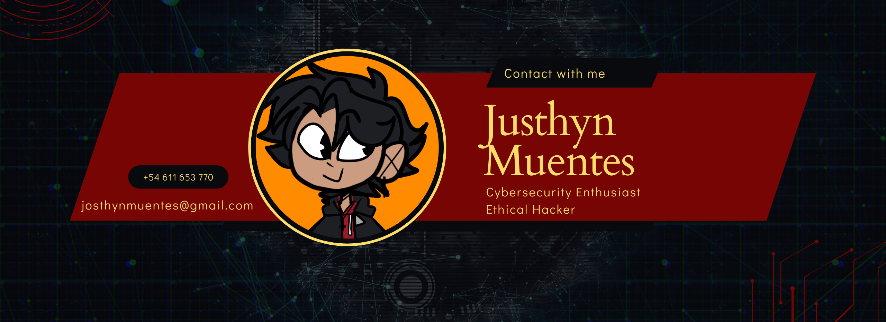

<!--Banner-->

<!--Header Name-->
#  ɪ'ᴍ JUSTHYN! 
*Cyber securty*
  

<!--Start Intro-->               

I am a . 

- ✨ Student of life :)
- 🌱 I’m currently learning many things, I believe that everyday is a learning opportunity.
- 💻 Visit my [Portfolio](https://JusthynM.github.io) for more details about me. 
<!--End Intro-->

## 🛠 &nbsp;Tech Stack

#### 🔧 Languages

#### 🔧 Tools

<!-- GITHUB STATS -->

  <h3 align="center">Stats:</h3>

    <a align="left">
      

</a>
    <a align="right">
&nbsp;
</a>  
  

 
 
 
 
 
 
 
 
 
 
 

-----

### Spotify Playing 🎧

---

  

------

### 🔗 &nbsp;Contact Me

</a>

<!-- FOOTER -->

  

